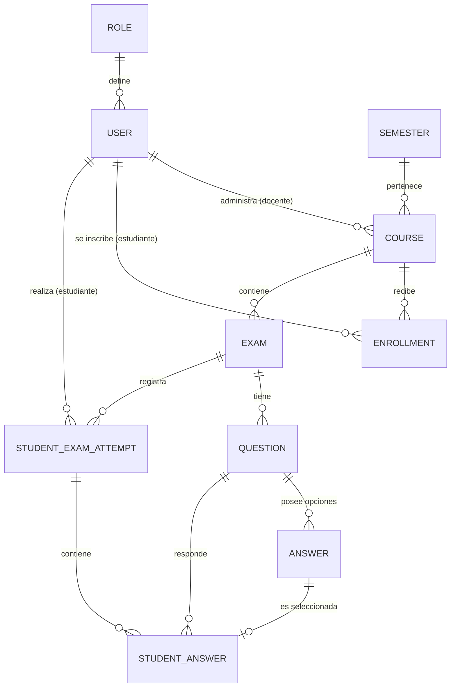

# Sistema de Evaluación de Razonamiento Lógico - UniCórdoba

Este proyecto es una plataforma web integral diseñada para la gestión y realización de evaluaciones académicas, con un enfoque particular en el razonamiento lógico. Permite a docentes administrar cursos y exámenes, y a estudiantes realizar pruebas con diversos tipos de preguntas y obtener resultados detallados.

## 🚀 Características Principales

### 👤 Gestión de Usuarios y Roles
- **Super Administrador:** Control total sobre usuarios, roles y configuración global.
- **Docente (Admin de Curso):** Gestión de cursos, estudiantes inscritos y creación/calificación de exámenes.
- **Estudiantes:** Acceso a cursos inscritos, resolución de exámenes y consulta de calificaciones.

### 📚 Administración Académica
- Gestión de **Semestres** y **Cursos**.
- Control de **Inscripciones** de estudiantes a cursos específicos.

### 📝 Sistema de Exámenes Dinámico
- Creación de exámenes con título, descripción, fecha de actividad y duración.
- **Tipos de Preguntas Soportados:**
    - `SINGLE_CHOICE`: Selección única.
    - `MULTIPLE_CHOICE`: Selección múltiple.
    - `MATCHING`: Emparejamiento de conceptos.
    - `TEXT_DEVELOPMENT`: Respuesta abierta (requiere calificación manual).

### 📊 Calificación y Seguimiento
- **Calificación Automática:** Para preguntas de opción múltiple y emparejamiento.
- **Calificación Manual:** Interfaz para que el docente califique respuestas abiertas.
- **Estadísticas de Rendimiento:** Resumen de notas promedio, tasa de aprobación y lista detallada de intentos por estudiante.
- **Seguridad en Intentos:** Control de tiempo y restricción de intentos una vez finalizados.

## 🛠️ Tecnologías Utilizadas

### Frontend
- **React (Vite):** Framework moderno para la interfaz de usuario.
- **CSS3 Personalizado:** Diseño "Glassmorphism" premium, oscuro y dinámico.
- **Lucide-React:** Set de iconos vectoriales.
- **Axios:** Cliente HTTP para comunicación con la API.

### Backend
- **Node.js & Express:** Entorno de ejecución y servidor web.
- **Sequelize ORM:** Manejo de la base de datos mediante modelos de objetos.
- **MySQL:** Base de datos relacional para persistencia de datos.
- **JWT (JSON Web Tokens):** Autenticación y autorización segura.

## 📐 Modelos de Datos

### Modelo Entidad-Relación (ER)
A continuación se presenta la representación gráfica de las entidades y sus relaciones:

### Modelo Relacional (Estructura de Tablas)
- `users` (id, full_name, email, cc, password, role_id, ...)
- `roles` (id, name)
- `semesters` (id, code, name, dates)
- `courses` (id, name, semester_id, teacher_id)
- `enrollments` (id, student_id, course_id)
- `exams` (id, course_id, title, activity_date, duration, ...)
- `questions` (id, exam_id, body, type, points)
- `answers` (id, question_id, body, is_correct)
- `student_exam_attempts` (id, student_id, exam_id, score, status, ...)
- `student_answers` (id, attempt_id, question_id, selected_answer_id/text)

## 💻 Instalación y Uso

1. **Clonar el repositorio:** `git clone <url_del_repo>`
2. **Backend:** 
   - `cd servidor`
   - `npm install`
   - Configurar `.env` con credenciales de base de datos.
   - `npm start`
3. **Frontend:**
   - `cd cliente`
   - `npm install`
---

© 2026 UniCórdoba - Sistema de Evaluación de Razonamiento Lógico. Todos los derechos reservados.
