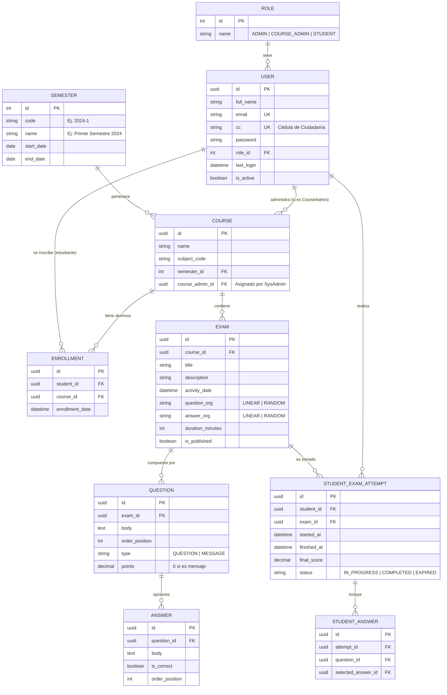

# Modelo de Gestión de Evaluaciones Académicas - UniCórdoba

Este documento detalla el diseño de la arquitectura de datos y el modelo entidad-relación (ER) para el sistema de razonamiento lógico y gestión de cursos. El modelo ha sido diseñado siguiendo estándares de normalización (3NF) y mejores prácticas para garantizar escalabilidad, integridad y trazabilidad.

## 📊 Diagrama Entidad-Relación (Mermaid)

## 🔐 Roles y Seguridad

1.  **Administrador del Sistema (SysAdmin)**:
    *   Gestiona usuarios (CREAR/EDITAR/ELIMINAR).
    *   Crea cursos y asigna **Administradores de Curso**.
    *   Configura parámetros globales del sistema y semestres.
2.  **Administrador de Curso (CourseAdmin)**:
    *   Diseña el banco de preguntas y respuestas para su curso.
    *   Configura la aleatoriedad y reglas del examen.
    *   Visualiza las estadísticas detalladas del grupo (promedios, desviaciones, curvas de rendimiento).
3.  **Estudiante**:
    *   Ingreso mediante **Email Institucional** y **CC (Cédula de Ciudadanía)**.
    *   Gestión de perfil (Avatar, ajustes personales).
    *   Dashboard personalizado: Exámenes realizados (con resultados), Exámenes pendientes y Fecha de actividades.

## 🛠️ Detalles del Modelo (Consideraciones de Experto)

Para optimizar la gestión y administración de la base de datos, se han implementado las siguientes características avanzadas:

### 1. Dinámica de Preguntas y Mensajes
*   **Polimorfismo Simple**: La tabla `QUESTION` permite el tipo `MESSAGE`. Si el tipo es `MESSAGE`, el sistema no espera una respuesta vinculada y los puntos se calculan como `0`. Esto permite insertar instrucciones o mensajes motivacionales entre las preguntas.
*   **Ordenación Flexible**: Los campos `question_org` y `answer_org` en la tabla `EXAM` determinan si el motor de renderizado del cliente debe respetar el `order_position` o barajar los elementos mediante un algoritmo (Ej: Fisher-Yates).

### 2. Integridad de los Exámenes
*   **Inmutabilidad de Intentos**: Una vez que un estudiante inicia un intento (`STUDENT_EXAM_ATTEMPT`), se captura una "foto" del examen. Si el profesor edita la pregunta *después*, el intento del alumno ya iniciado no se ve alterado para evitar inconsistencias en las calificaciones.
*   **Cierre Automático**: Se recomienda un *cron job* que verifique la `finished_at` comparada con la `duration_minutes` para cerrar intentos expirados.

### 3. Estadísticas de Grupo (Cálculo Eficiente)
*   **Vistas Materializadas**: Para no sobrecargar la base de datos calculando promedios en tiempo real, se proponen vistas o procesos de agregación que calculen la **estadística de grupo** por examen semanalmente o tras cada entrega masiva.

### 4. Auditoría y Trazabilidad
*   Todas las tablas incluyen `created_at` y `updated_at`.
*   Se recomienda una tabla de `LOGS` para auditoría, registrando qué administrador cambió qué nota o qué pregunta y cuándo.

### 5. Optimización de Búsqueda (Índices)
*   Índice Único en `USER(email)` y `USER(cc)` para un login ultrarrápido.
*   Índice compuesto en `STUDENT_EXAM_ATTEMPT(student_id, exam_id)` para recuperar rápidamente el historial de un alumno.

---
> **Nota de Implementación**: La relación `STUDENT_ANSWER` es vital para el "Review" post-examen, permitiendo al estudiante ver qué marcó y cuál era la respuesta correcta proporcionada por el Administrador de Curso.
